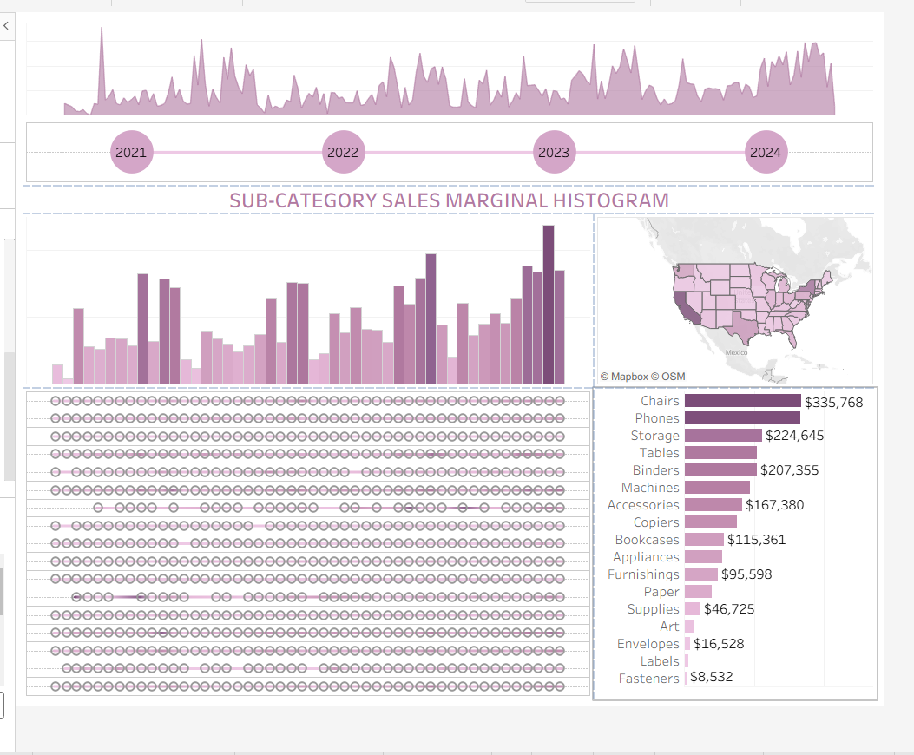

# Sub-Category Sales Marginal Histogram

**Author:** Dhanalakshmi Kannur Munirathnam  
**Course:** BIS 582 – Data Visualization (Central Michigan University)  
**Tool:** Tableau  
**Dataset:** Sample Superstore (US Retail Sales Data)

---

## 📊 Project Overview
This Tableau dashboard provides a **marginal histogram analysis** of U.S. product sub-category sales from 2021 to 2024.  
It combines **time-series trends, regional mapping, and sub-category breakdowns** to show how different product lines perform over time.

---

## 🎯 Key Insights
- Overall sales grew steadily after 2021, with visible peaks in late 2023 and early 2024.  
- **Furniture categories** (Chairs and Tables) lead in sales, surpassing $300 K, while **office supplies** such as Labels and Fasteners remain lowest.  
- **Southern and Eastern U.S. regions** record the strongest cumulative sales.  
- Combining histograms with maps highlights seasonal spikes and regional variability.

---

## 🗺️ Dashboard Components
1. **Time-Series Line Chart** – Monthly sales trends (2021-2024)  
2. **Marginal Histogram** – Sub-category sales distribution  
3. **U.S. Sales Map** – Regional sales density by state  
4. **Ranked Bar Chart** – Top sub-categories by total sales  
5. **Dot Plot** – Individual sales events over time  

---

## 🧠 Tableau Techniques Used
- Marginal histogram integration with dual-axis charts  
- Hierarchical filters for year and sub-category  
- Geographic visualization with Mapbox OSM layers  
- Layout optimization for Desktop (1000 × 800)  
- Color palette harmonized for consistent tone and emphasis  

---

## 🌐 View Interactive Dashboard
[View on Tableau Public →](https://public.tableau.com/views/FirstName-LastName-BIS582Assignment5/Dashboard2?:language=en-US&publish=yes&:sid=&:redirect=auth&:display_count=n&:origin=viz_share_link)

---

## 📷 Preview

---

## 📂 Files
| File | Description |
|------|--------------|
| `FirstName-LastName-BIS582_Assignment5.twbx` | Tableau packaged workbook |
| `Screenshot 2025-10-05 110852.png` | Dashboard screenshot |

---

## 💡 Reflection
This assignment strengthened my ability to design **multi-component dashboards** that combine **spatial, temporal, and categorical analysis**.  
It also taught me how to present **dense sales data visually** through a minimal, consistent color theme and balanced layout.
